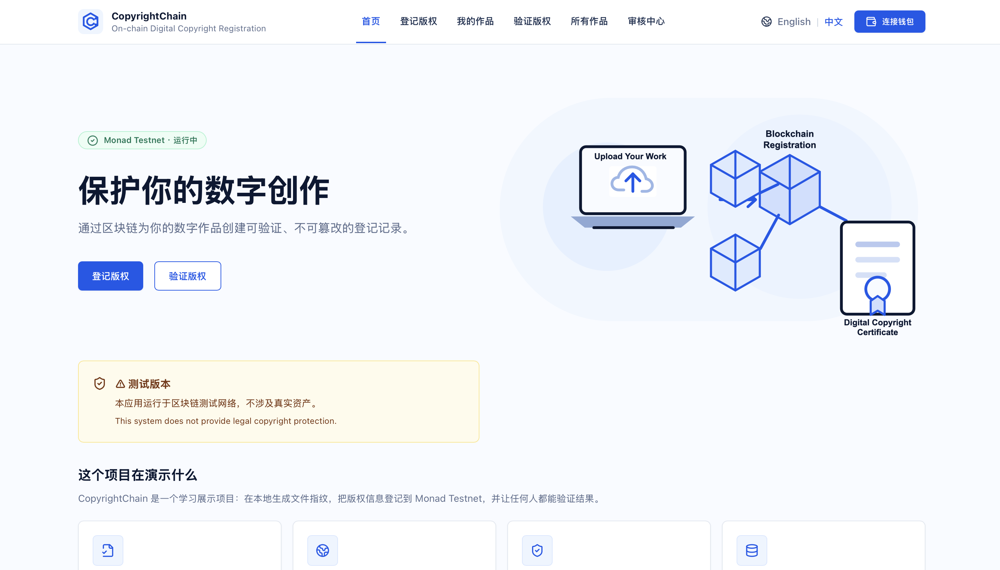
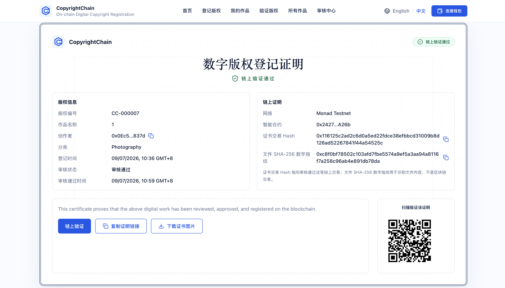

# CopyrightChain

**English** | [中文](README.zh-CN.md)

     

Public demo: https://copyrightchain-public.vercel.app/

CopyrightChain is a university Web3 mini demo for blockchain-based digital copyright registration on Monad Testnet.

It demonstrates how a creator can:

1. Generate a SHA-256 file fingerprint locally.
2. Register copyright metadata and the file hash through a smart contract.
3. Receive a certificate ID such as `CC-000001`.
4. Let others verify the record on chain.

## Product Demo

### Homepage and testnet workflow



The homepage presents registration and verification entry points, the active Monad Testnet status, and a clear notice that the project is an educational prototype rather than a legal copyright service.

### Verifiable on-chain certificate



An approved record produces a certificate view containing the certificate ID, creator wallet, registration time, contract address, transaction hash, and local SHA-256 file fingerprint. Visitors can follow the verification link or scan the QR code to inspect the public testnet record.

## Important Demo Notice

This application is a prototype deployed on a blockchain testnet for educational and demonstration purposes only.

No real assets are involved. This system does not provide legal copyright protection.

## Structure

```text
contract/   Solidity smart contract, Hardhat tests, deployment script
frontend/   React + TypeScript + Vite DApp interface
```

## Contract

```bash
cd contract
npm install
npm run test
```

For testnet deployment, create `contract/.env`:

```bash
PRIVATE_KEY=your_wallet_private_key
RPC_URL=https://testnet-rpc.monad.xyz
CHAIN_ID=10143
NETWORK_NAME=Monad Testnet
```

Then run:

```bash
npm run deploy:monad
```

The deployment script updates `deployment-info.json` and the frontend deployment copy.

## Frontend

```bash
cd frontend
npm install
npm run dev
```

Optional `frontend/.env`:

```bash
VITE_CONTRACT_ADDRESS=
VITE_CHAIN_ID=10143
VITE_NETWORK=Monad Testnet
VITE_RPC_URL=https://testnet-rpc.monad.xyz
VITE_EXPLORER_URL=
VITE_REVIEWER_ADDRESS=0x0Ec53965623c01C8C5a3af8F0d42Bb84cf7b837d
VITE_SUPABASE_URL=
VITE_SUPABASE_ANON_KEY=
VITE_ADMIN_PASSWORD_HASH=
```

If no contract address is configured, the UI still renders but chain-write actions are disabled with a deployment notice.

## Vercel Deployment

The Vite development URL works only on your computer. To share the app, deploy the `frontend/` folder to Vercel.

```text
Framework Preset: Vite
Root Directory: frontend
Build Command: npm run build
Output Directory: dist
Install Command: npm install
```

Recommended project name and public URL:

```text
copyrightchain-public
https://copyrightchain-public.vercel.app
```

Environment variables:

```bash
VITE_CONTRACT_ADDRESS=
VITE_CHAIN_ID=10143
VITE_NETWORK=Monad Testnet
VITE_RPC_URL=https://testnet-rpc.monad.xyz
VITE_EXPLORER_URL=
VITE_REVIEWER_ADDRESS=0x0Ec53965623c01C8C5a3af8F0d42Bb84cf7b837d
VITE_SUPABASE_URL=https://eqbdsxhwxbbhgvprmxyi.supabase.co
VITE_SUPABASE_ANON_KEY=sb_publishable_cH80mg4w2dykFjeUSUPMtw_wYKFO4aN
VITE_ADMIN_PASSWORD_HASH=
```

Public pages:

```text
/register
/verify
/my-works
/explorer
```

Password-gated Review Center pages:

```text
https://copyrightchain-public.vercel.app/admin/deploy
https://copyrightchain-public.vercel.app/admin/review
```

The Review Center password gate is only a lightweight demo barrier. Real approval is protected by the reviewer MetaMask wallet. If the Register page shows `Not deployed`, the public Vercel app still needs a contract address; the wallet or network is not necessarily the problem.

Deploy from `/admin/deploy`, add the resulting address to `VITE_CONTRACT_ADDRESS` in Vercel, and redeploy.

## Supabase Public Review Queue

Use Supabase when friends need to submit applications from their own devices. Only frontend-safe values are required:

```text
Project URL
anon public key
```

Never put a `service_role` key in the frontend.

Setup:

1. Create a Supabase project.
2. Open Supabase SQL Editor.
3. Run `supabase/schema.sql`.
4. Create `frontend/.env` from `frontend/.env.example`.
5. Fill the public project values:

```bash
VITE_SUPABASE_URL=https://your-project.supabase.co
VITE_SUPABASE_ANON_KEY=your-anon-public-key
```

After setup, `Submit Without Wallet` sends applications to Supabase instead of browser-only storage. A reviewer can open `/admin/review`, enter the Review Center password, and approve, reject, or hide records with MetaMask.

The included Supabase policies are intentionally public for a university demo. In production, move approval updates behind a Supabase Edge Function that verifies a reviewer MetaMask signature.

If the table predates the reject/hide features, run `supabase/schema.sql` again so the `rejected` and `hidden` statuses and `hidden_certificates` table are available.

## Public Deployment and Review Flow

Reviewer wallet:

```text
0x0Ec53965623c01C8C5a3af8F0d42Bb84cf7b837d
```

1. Open `https://copyrightchain-public.vercel.app/admin/deploy`.
2. Enter the Review Center password.
3. Connect MetaMask with the reviewer wallet.
4. Click `Deploy with MetaMask` and approve the transaction.
5. Add the deployed address to `VITE_CONTRACT_ADDRESS` in Vercel and redeploy.
6. Share `https://copyrightchain-public.vercel.app/register`.
7. Users can choose:
   - `Use Visitor Wallet`: submit an on-chain pending application from an injected EVM wallet such as MetaMask or Rabby.
   - `Submit Without Wallet`: submit a pending application to the Supabase review queue.
8. Open `/admin/review`, enter the password, and approve, reject, or hide applications with the reviewer wallet.

Only approved applications are shown as verified certificates. On-chain records cannot be deleted; hiding affects only the website's public display.

For local development, run `npm run dev` in `frontend/` and open the Vite URL printed in the terminal.
